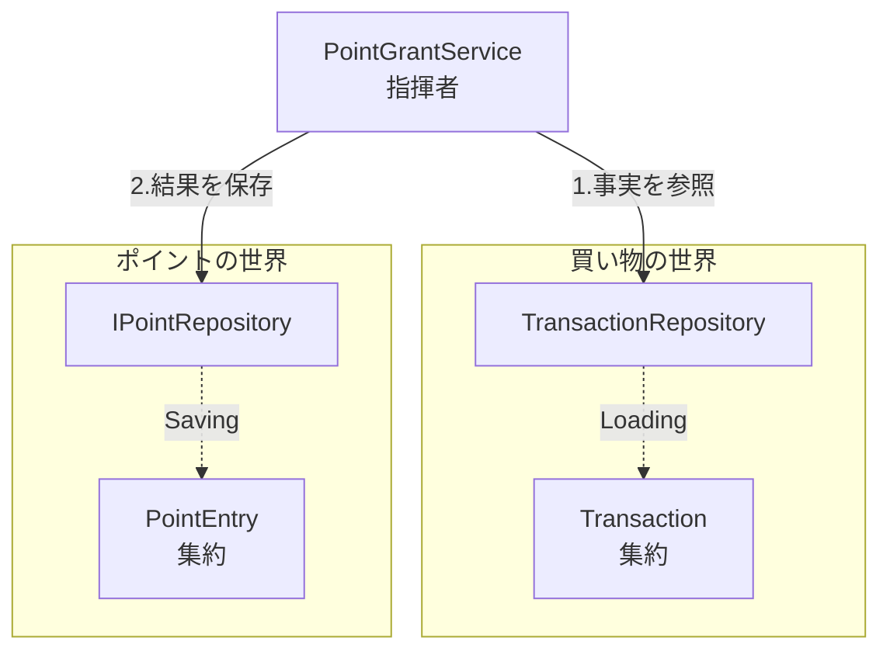

```mermaid
flowchart TD
Service[PointGrantService<br>指揮者]

    subgraph Buying[買い物の世界]
        RepoA[TransactionRepository]
        AggA[Transaction<br>集約]
    end

    subgraph Point[ポイントの世界]
        RepoB[IPointRepository]
        AggB[PointEntry<br>集約]
    end

    Service -->|1.事実を参照| RepoA
    Service -->|2.結果を保存| RepoB

    RepoA -.->|Loading| AggA
    RepoB -.->|Saving| AggB

```
